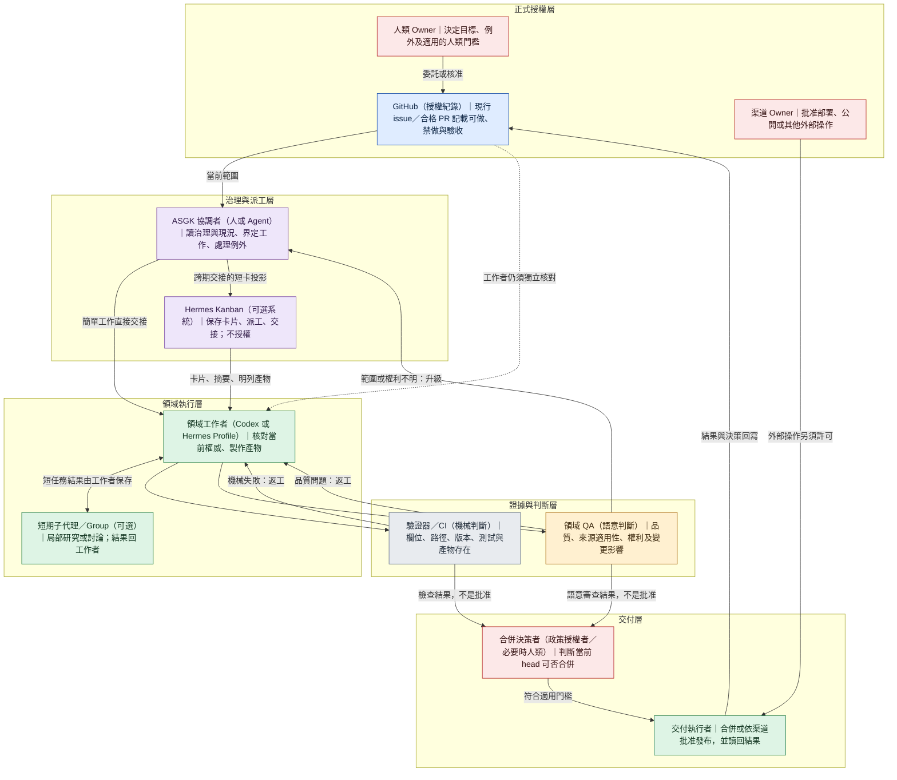
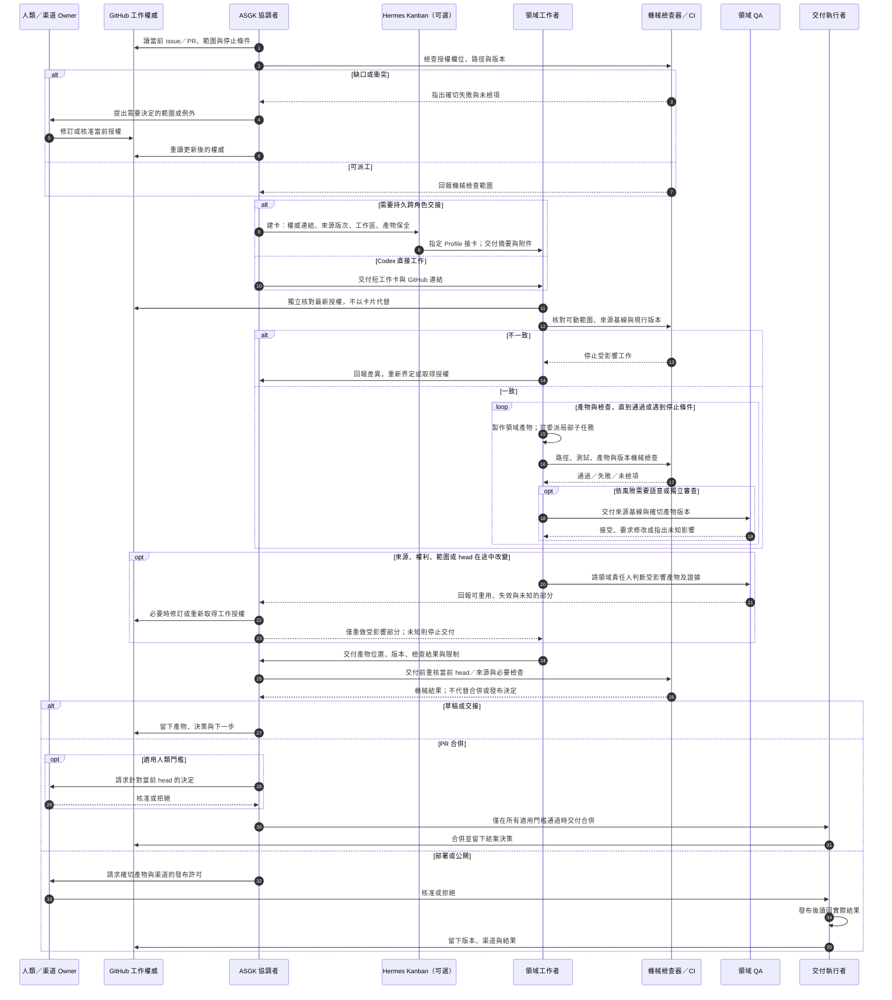

# ASGK 3.x 角色與交接架構候選

> 狀態：討論草稿，非現行規則、非第二套權威。此文件只供架構檢討；不得從圖推論新的工作、合併或發布許可。
>
> 工作單元：[ASGK #415](https://github.com/stereosurfer/agent-safe-dev-governance-kit/issues/415)。基準：遠端 `main` 的 `c73d965cd3f91a96cfd7a5ba94925d1aba226e92`，已發布的 source-only v3.0.0 之後。

## 本次要檢驗的 3.0 目的

ASGK 要讓人與 AI 安全、順利交接工作：接手者知道做什麼、去哪裡做、不做什麼、禁止動什麼，最後能快速追溯接受、拒絕、改寫或回退的決策。工作不依賴特定模型、供應商、Agent 或舊對話。3.0 的架構檢討還必須回答一個實際問題：在保留這些能力時，能否減少治理操作和執行者的注意力負擔，而不是把工作變成「讀 ASGK」。

本文件區分責任，不強制每個責任各有一個 Agent。簡單的 Codex＋GitHub 工作可以由同一人或 Agent 兼任部分角色；長期、跨角色或高風險工作可使用專責協調者與持久執行者。角色可以合併，授權、證據與判斷的性質不能混淆。

## 討論前已確認的界線

- GitHub 的現行 issue／合格 PR 承載 repo 工作範圍；卡片、Bot 記憶、Group 對話與子代理摘要是投影或執行證據，不能自生授權。對外操作另須對應渠道權限。
- 專責協調者負責最小必要的治理閱讀、投影短卡、例外升級與決策收束；領域工作者仍須獨立核對當前工作權威，但不應重讀整包無關治理材料。
- 機械檢查只能報告具體檢查項、失敗與未檢項；領域品質、來源適用、權利及變更影響需要語意判斷；兩者都不能冒充人類門檻。
- Hermes Kanban、Profile、Group、子代理屬可選運行層。Codex＋GitHub 直接路徑保持完整；Kanban `done` 不等於 issue 結案、PR 合併或公開發布。
- 定期排程是觸發，不是寫入權限。無實質變更可留下 no-op 紀錄並結束。有限期週期授權是待評估政策提案，不在本文件中宣布為現行 3.0 功能。
- 草稿、PR 合併與對外發布有不同交付邊界。原始私人素材、媒體和運行輸出不因架構圖而變成可提交 GitHub 的材料。

## 圖一：角色與權威

紅色代表人類或渠道批准，藍色代表 GitHub 的正式工作權威。紫色是治理／派工投影，綠色是執行，灰色是機械證據，橙色是語意判斷；後四者不能自行擴張授權。

## 圖二：階段間交接與檢查小迴圈

這張時序圖只畫確實有工作要做的一次執行。它表達責任交接與可能的回圈，不主張每個低風險任務都必經獨立 QA、Hermes 或人類批准。

## 現行能力、架構提案與證據界線

| 類別 | 可作為設計基礎的事實 | 不能由圖推論的事 |
| --- | --- | --- |
| ASGK 3.0 source | GitHub issue／合格 PR 承載當次工作權威；根目錄規則、validator、PR/MDR 與 close-out 是已發布的 source-only 表面。 | 圖不是新規則；短卡、模型判斷或 validator pass 不授權合併／發布。 |
| Hermes（可選） | Kanban 是持久卡片與交接；Profile 是持久身分／設定；子代理只把結果送回父工作者。Hermes 已有有界的 PR completion contract。 | Profile 不是沙箱；Kanban `done` 或 required-check pass 不是 ASGK 批准、merge 或 close-out。 |
| 目前未證明 | 兩張圖提出協調者、短卡、檢查與交付的責任分離。 | 3.0 尚未證明完整流程圖、定期無人更新、人類或跨供應商接手、一般化 Kanban 整合，或實際降低時間／token／治理負擔。 |

Hermes 同卡 `review` 與下游 QA 卡是兩種不同交接拓樸，實際工作須選其一；暫存 `scratch` 的產物必須在送審／完成時明列保存，或改用適當的持久工作區。這是運行設計問題，不應變成每個 repo 的通用必經步驟。

## 小組會議要回答的問題

1. 專責協調者是否真的減少工作者的治理注意力，還是只增加一次重複閱讀與等待？
2. 接手者的最小獨立核對是哪些資料？哪些交接只能靠當前 live read，哪些可安全用卡片或摘要？
3. 缺口、機械失敗、語意返工、來源變更各由誰判斷、由誰改 scope、何時停止？圖是否藏了死循環？
4. Codex＋GitHub 的簡單網站更新，是否因這個架構增加了不必要的角色、工單或 QA？
5. 翻譯的來源／術語版次與影音素材權利，應由各自的交付契約處理多少？ASGK 通用層只需要知道哪些邊界？
6. 若提議有限期週期授權，怎樣避免它成為無限期寫入許可？此題屬未來政策設計，不是本文件的現行權限。
7. 何種模擬與實測才足以支持「交接品質不退步、治理成本下降」？哪些證據只能支持局部結論？

## 小組會議記錄

### 方法與總判斷

三位未修改文件的 AI 冷審者分別檢查產品／注意力成本、Hermes 官方運行機制、網站／翻譯／影音交付；再進行一輪交叉質疑。這是架構推演，不是真人陌生接手或端到端運行測試。圖一與圖二保留為會前基準，以便下一版能看出真正修了什麼。

**結論：部分達到 3.0 目的，但尚未達到「治理成本下降」的架構要求。** 權威、執行、機械證據、語意判斷及外部發布已分層；但是圖目前使協調者成為所有工作必經的排隊點，且幾條返工／授權箭頭會讓接手者誤判可否繼續。不能把角色分層的清楚性當成已證明的可用性或效率。

### 共同確認的最高優先缺口

1. **簡單工作的直達路徑只存在於文字。** 圖一的 `G → C → W` 與圖二從 C 開始的全程，使單一 Codex＋GitHub 網站工作仍要等待 C。下一版須畫 `G → W` 的實線，以及「直接工作／協調交接」的真正分支；專責 C 用在跨期、跨角色、例外或風險上升，不是所有工作的新關卡。
2. **協調者不可自行修訂授權。** 圖二 `C → G：必要時修訂或重新取得工作授權` 有自我授權歧義。正確交接是 C 提出具體差異；有權者在當前 GitHub 權威記錄決定；C 和 W 再讀最新版本。未決時只停止受影響工作。
3. **變更後不能沿用舊檢查直接交付。** 來源、術語、權利、scope 或 head 改變時，先由適當領域責任人判斷影響；已知受影響部分重做並重跑相應機械／語意檢查，未受影響且版次可證者才沿用證據；影響未知即停止。圖二目前缺回到 M／Q 及當前 head 決策的箭頭。
4. **合併與發布不是互斥的三選一。** 網站與翻譯可先 merge，再 deploy；影音可向多個渠道分別發布。下一版應讓草稿可終止、PR 合併是可選的一道交付邊界、每個公開渠道另有精確輸出版本／渠道許可與 readback。readback 不吻合須有失敗、修復和不得結案的路徑。
5. **短卡需能讓陌生接手者接得下去。** 短卡應只投影權威 URL／revision、做什麼、去哪裡做、不做什麼、禁動什麼、停止／升級、來源和產物版本、檢查與未檢項、證據位置及下一步；不能複製整份 issue，也不能取代接手者對當前權威的獨立核對。

### Hermes 機制校正

- Kanban 現成派工對象是已配置的 Hermes Profile；它不原生把 Codex CLI 當 worker lane。dispatcher、Profile 或工作區失敗時需明確處理卡片停在 `ready` 的 stranded 診斷、故障與 `blocked` 狀態；Codex＋GitHub 應保持獨立直達路徑。
- `delegate_task` 是短期父子任務，最終摘要回父工作者；Group 是多個持久 Bot 的討論房間，不會自動把結論寫進父工作者或 GitHub。圖一把兩者合成一格應拆開，重要結論須由責任人採錄。
- Hermes 同卡 `request_review` 與實作卡 `complete` 後解鎖下游 QA 卡只能擇一；每次 worker run 還須以 `complete`、`request_review` 或 `block` 合法收束。QA 語意接受不自動等於 Kanban `done`。
- 暫存 `scratch` 產物不是建卡後自動永久保存。工作者須在送審／完成時明列存在的 artifacts，讓後手讀回附件或持久工作區；Profile 與工作區都不構成作業系統權限沙箱。
- Hermes PR completion contract 可在卡完成時核對綁定 PR 的 required checks／當前 head，屬一次有界機械收據；它不代替 ASGK issue、MDR、人類門檻、GitHub merge 或發布讀回。

### 三個案例對圖的攻擊

- **網站，無 Hermes：** 定期排程先唯讀判斷來源是否實質變動；無變更留下來源版次與 no-op 原因，不開空 PR、不跑多餘 QA。有變更才走當前授權、內容修改、必要測試與風險相稱的語意檢查。PR merge 與上線是兩件事，線上頁面需對照批准的版本讀回。
- **翻譯：** 交接至少指出來源版、術語版、語系、譯稿 ID 與 QA 適用範圍。變更時由內容／術語責任人判斷哪些段落與語系受影響，並對新輸出重檢；不能因版本不同就全量返工，也不能因局部可重用就放行失效譯文。
- **影音：** 草稿可在明示「不可發布」時先使用占位素材；新增第三方素材或跨渠道輸出時，權利責任人核對用途、地區、期限與渠道。原始私有素材不進 GitHub。每個渠道對確切 cut／字幕／縮圖版本分別批准與讀回，錯版或不可見不得寫成成功結案。

### 小組歧見與收斂

獨立 QA、Hermes、專責協調者都不應成為每件小工作的固定門檻；但角色可由同一人兼任，不代表證據種類或適用的人類／渠道批准可合併。簡單網站工作可由 Codex 兼 C／W，仍需 live authority、實際測試證據與適用發布許可；翻譯跨語系及影音權利升級才顯式增加領域／權利審查。定期 no-op 屬外圍唯讀觀測；有限期週期授權需要另行修改現行政策，不由本圖或 Kanban 卡宣告成立。

### 下一版圖與驗證要求

下一版圖先修五項共同缺口，再選三條流程走查：單人直達、跨期交接、外部權利／多渠道。每個返工環應有通過、有證據的 no-op、以及未知／越權／反覆失敗時停止升級的出口。決策收束須能分辨接受、拒絕、改寫、回退及其 GitHub 連結。

量測時與現行 Codex＋GitHub 基線配對比較：取得授權至首次可編輯的 p50/p95 等待、治理閱讀與模型用量、重複完整閱讀次數、每單位協調／QA 往返次數；同時要求陌生接手者正確回答「做、去哪、不做、禁動、現有證據、下一步」，越權續做為零，且可在限定連結步數內找回決策。圖、模型會議或 validator pass 都不能替代這些實測。

## 參考邊界

- [ASGK 3.0 current README](https://github.com/stereosurfer/agent-safe-dev-governance-kit/blob/c73d965cd3f91a96cfd7a5ba94925d1aba226e92/README.md)
- [ASGK 3.0 current AGENTS.md](https://github.com/stereosurfer/agent-safe-dev-governance-kit/blob/c73d965cd3f91a96cfd7a5ba94925d1aba226e92/AGENTS.md)
- [Hermes Kanban](https://hermes-agent.nousresearch.com/docs/user-guide/features/kanban)
- [Hermes Kanban worker lanes](https://hermes-agent.nousresearch.com/docs/user-guide/features/kanban-worker-lanes)
- [Hermes Profiles](https://hermes-agent.nousresearch.com/docs/user-guide/profiles)
- [Hermes Subagent Delegation](https://hermes-agent.nousresearch.com/docs/user-guide/features/delegation)
